# Manual de Usuario

En este manual se describe el uso y las funcionalidades de la aplicación móvil de FixYourPlants. También se incluye información sobre cómo acceder a la documentación de la API.

## Aplicación Móvil

La primera pantalla que aparece es la de inicio, a través de la cual se puede acceder a las secciones de plantas, enfermedades, plagas, usuario y ayuda.

| 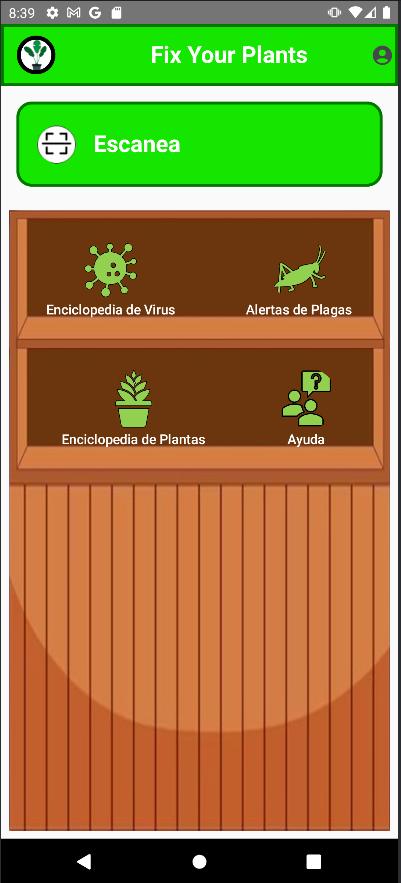 |
|:--:|
| *Pantalla de inicio* |

### Sección de Usuario

Esta sección es accesible mediante el icono en la esquina superior derecha. Si el usuario no ha iniciado sesión, se mostrará el siguiente formulario para hacerlo. El inicio de sesión se puede hacer mediante correo y contraseña o automáticamente usando la cuenta de Google registrada en el teléfono.

| 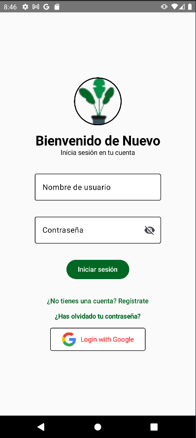 |
|:--:|
| *Iniciar Sesión* |

Si no tienes una cuenta registrada, presiona en "¿No tienes cuenta? Regístrate" para redirigirte al formulario de registro, que también puede rellenarse automáticamente mediante una cuenta de Google. Es necesario verificar la cuenta de Gmail antes de poder iniciar sesión. Un correo con un enlace de verificación será proporcionado tras realizar el registro con éxito. Al finalizar la verificación, se podrá usar la cuenta sin problemas.

| 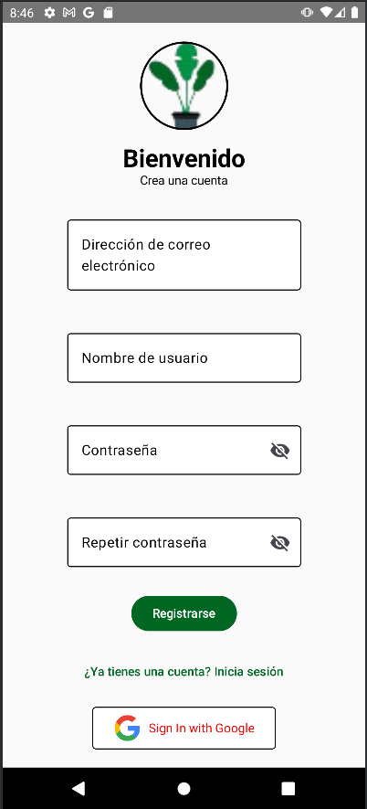 |
|:--:|
| *Registrar Usuario* |

Después de iniciar sesión, al presionar el icono de usuario nuevamente, aparecerá un menú con diferentes opciones. Al presionar la opción "Mi perfil", se mostrarán los detalles de tu perfil:

| 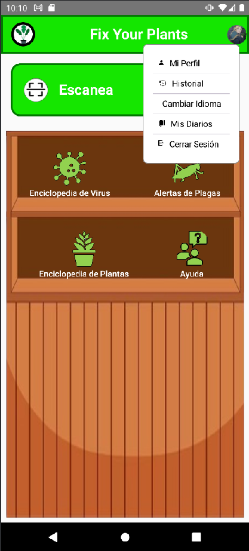 |
|:--:|
| *Menú de Usuario* |

| 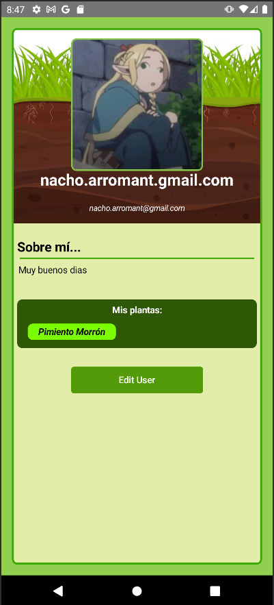 |
|:--:|
| *Perfil de Usuario* |

Para actualizar el perfil, presiona el botón de "Editar Usuario" para acceder al formulario correspondiente.

| 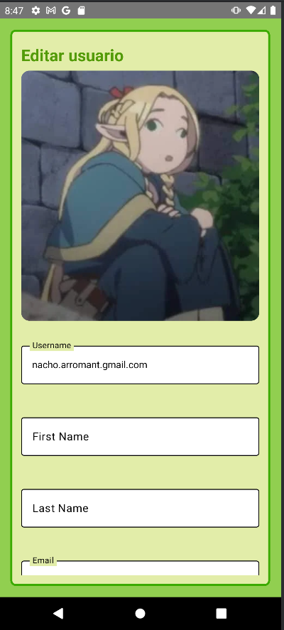 |
|:--:|
| *Formulario Edición de Usuario* |

### Sección de Plantas

Al presionar en la sección de plantas, se accede al listado de plantas, donde se mostrarán todas las plantas registradas en la aplicación junto con un filtro que no distingue entre tildes.

| 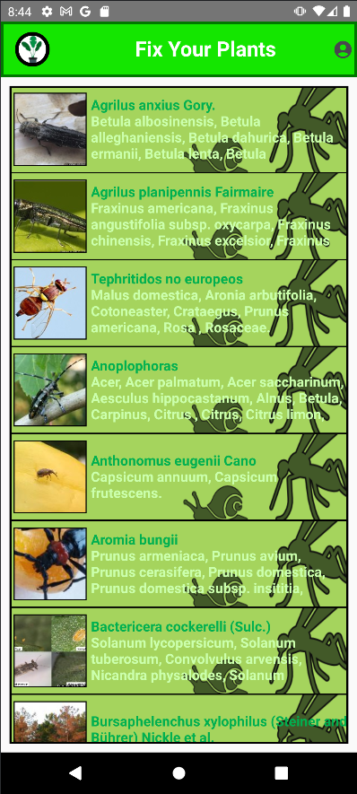 |
|:--:|
| *Listado de Plantas* |

| 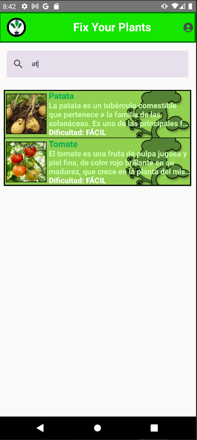 |
|:--:|
| *Filtro Listado de Plantas* |

Al presionar la imagen de una planta, se accede a la sección de detalles de la planta. Dentro de los detalles de la planta, hay dos secciones: una con más detalles de la planta y otra con las opiniones de diferentes usuarios respecto a la planta. Presionando el icono con forma de corazón (necesario haber iniciado sesión) se añadirá la planta a favoritos.

| 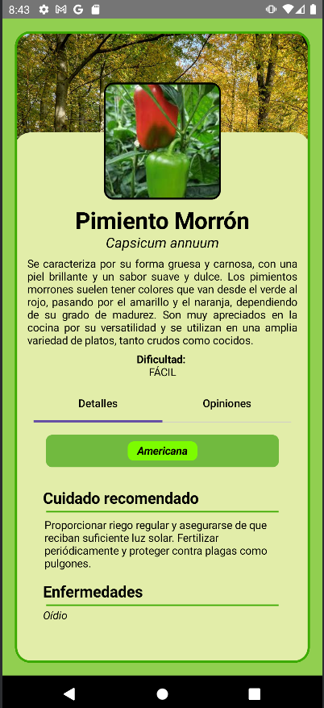 |
|:--:|
| *Detalles de Planta* |

| 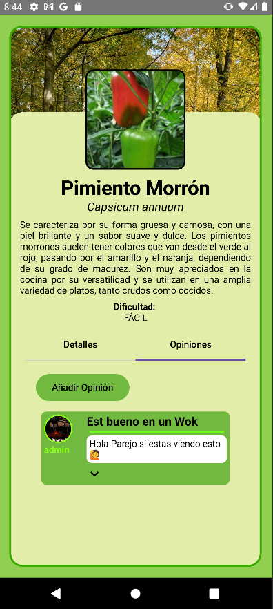 |
|:--:|
| *Opiniones de Planta* |

### Sección de Enfermedades

En la pantalla de inicio, al presionar el botón de enfermedades, se accede a una pantalla similar con un listado de las enfermedades.

| 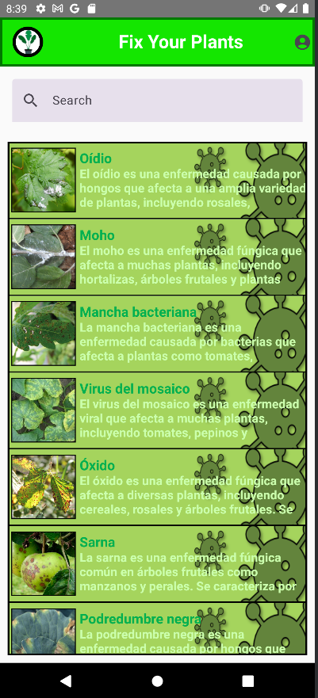 |
|:--:|
| *Listado de Enfermedades* |

Al presionar en una de las enfermedades listadas, se mostrará la pantalla de detalles de la enfermedad y mediante el icono de corazón se añadirá la enfermedad a favoritos.

| 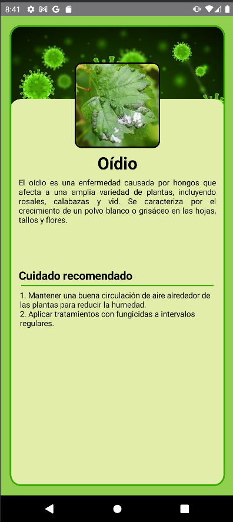 |
|:--:|
| *Detalles de Enfermedad* |

### Sección de Plagas

La siguiente sección accesible desde la pantalla de inicio es el listado de plagas. De la misma forma que con las enfermedades, se puede acceder a los detalles de las plagas.

|  |
|:--:|
| *Listado de Plagas* |

| 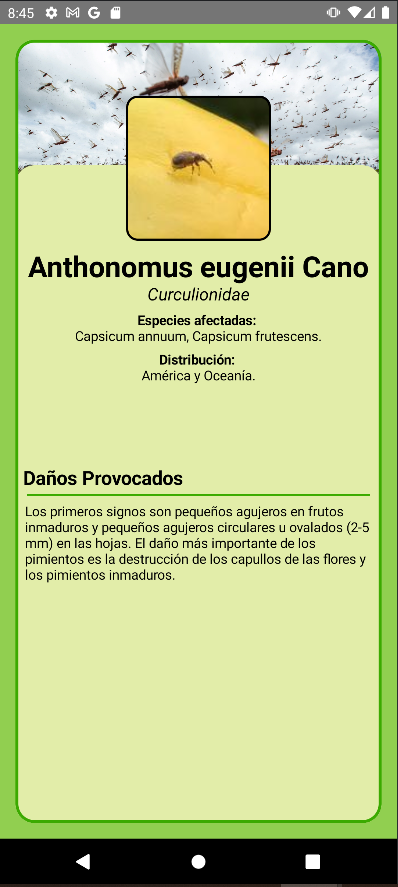 |
|:--:|
| *Detalles de Plaga* |

### Sección de Diarios

Si el usuario ha iniciado sesión y ha añadido al menos una planta o enfermedad a favoritos, en el menú desplegable que aparece al presionar el perfil dentro de la sección de diarios, aparecerá una entrada para cada una de sus plantas y enfermedades favoritas.

| 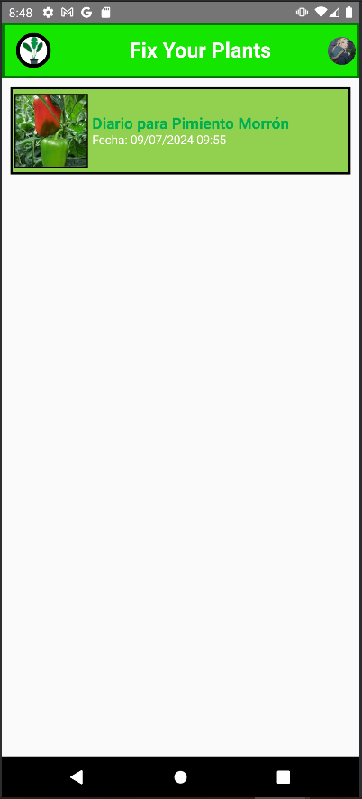 |
|:--:|
| *Listados de Diarios* |

Al presionar en uno de los diarios, se accede al listado de páginas y se puede crear una nueva página presionando el botón de "Crear página". Tenga en cuenta que solo se puede crear una página cada día.

| 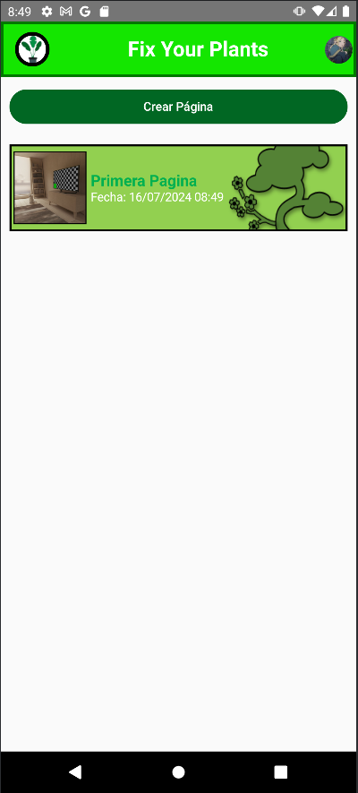 |
|:--:|
| *Listado de Páginas de Diario* |

| 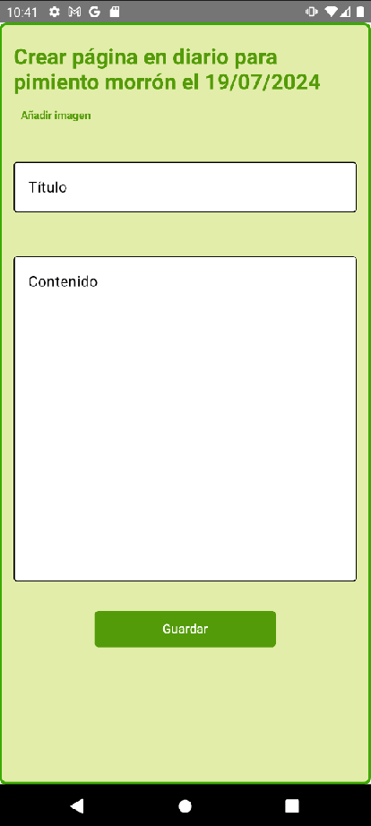 |
|:--:|
| *Crear Página de Diario* |

### Funcionalidad de Escaneo

Para utilizar la funcionalidad de escaneo de especies y enfermedades mediante nuestra IA, se puede acceder desde la pantalla de inicio y seleccionando la foto. Una vez escogida la foto, se mostrarán los resultados del escaneo. Tenga en cuenta que esta funcionalidad es exclusiva para usuarios registrados.

| 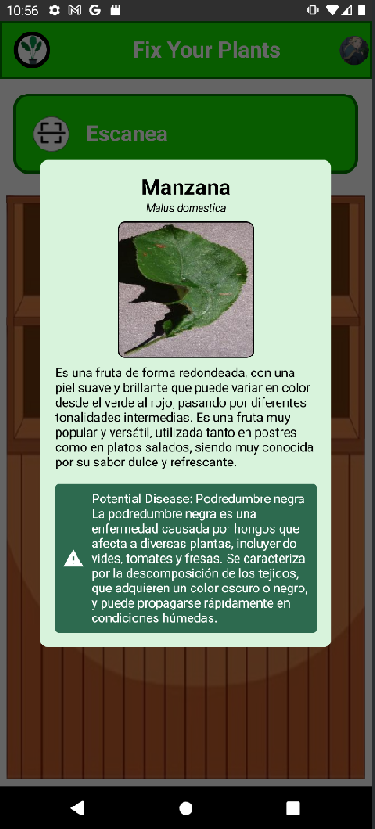 |
|:--:|
| *Resultado del Escaneo* |

**TODO: FALTA SECCIÓN DE HISTORIAL**

Finalmente, para repasar las funcionalidades de la aplicación, se puede acceder desde el menú principal a la sección de ayuda, donde se mostrará un pequeño tutorial de las funcionalidades.

## Documentación API

Para acceder a la documentación de la API y poder probarla, se puede encontrar en la siguiente URL: [https://fyp-api-0yf4.onrender.com/docs/](https://fyp-api-0yf4.onrender.com/docs/)

| 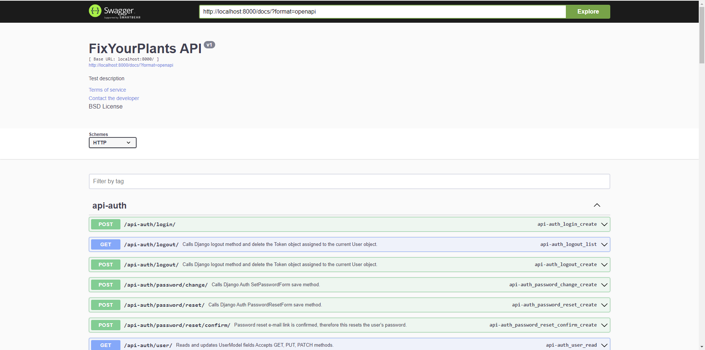 |
|:--:|
| *Documentación API* |